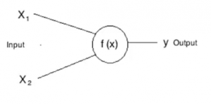
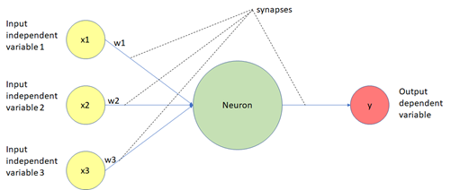
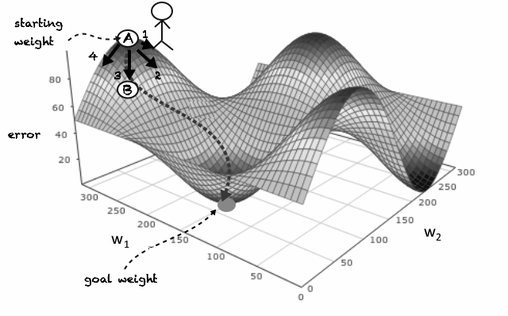
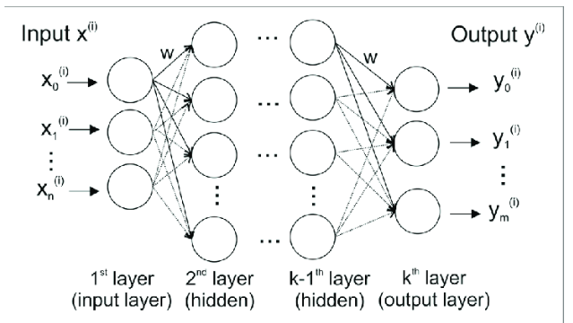
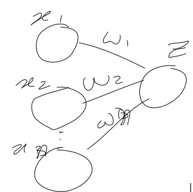
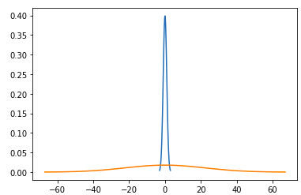
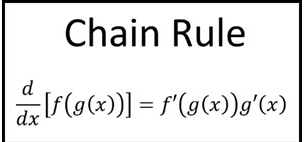
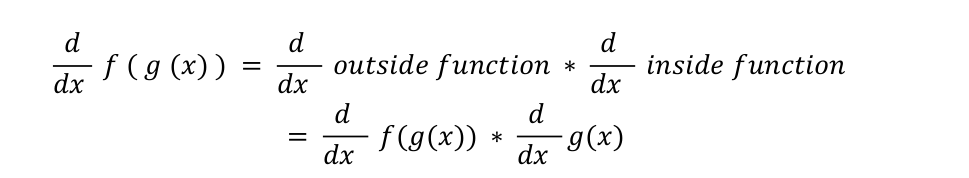
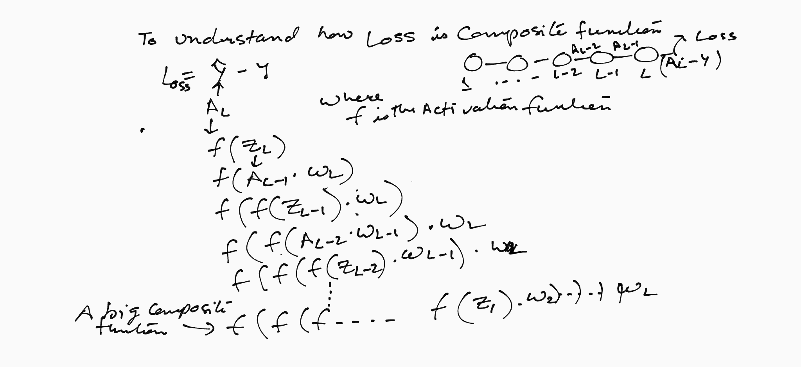
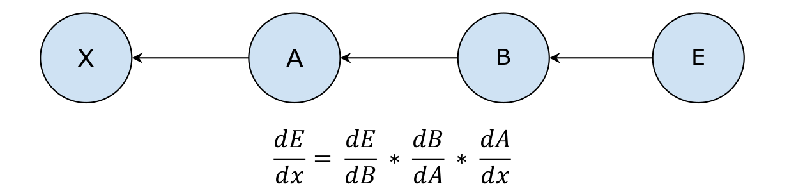

# Neural Networks #

This repo answers all the basic questions in and around Neural Networks also known as artificial neural networks (ANNs).

The Colab notebook link for the Assignment is
[Link](https://github.com/TSAI-END3-Group/Session_1_Assignment/blob/main/END3_0_Session_1.ipynb) where we have successfully achieved the desired outcome applying the below conditions:
1. remove the last activation function
2. make sure there are in total 44 parameters
3. run it for 2001 epochs

**NOTE:**
While training this Neural Network for the X-OR gate, we observed that using MSE-Loss over L1-Loss results in much lower error for the network.

#### Model Summary:
1. **Input Layer:** It comprises of 2 neurons as inputs which are connected to hidden layer (which has 5 neurons )
`#params = 5*2+5(Bias) = 15 Parameters`
2. **Two Hidden Layer:** It conatins 5 and 4 neurons respectively.
`#params = 5*4+4(bias) = 24 Parameters`
3. **Output Layer:** Final layer which has a single neuron and connected through hidden layer having 4 neurons.
`#params = 4*1+1(bias) = 5 Parameters`
```Total Parameters = 15+24+5 = 44```


## Assignment Questions:
- [Question-1](#question-1)
- [Question-2](#question-2)
- [Question-3](#question-3)
- [Question-4](#question-4)
- [Question-5](#question-5)

Neural Networks are comprised of a node layers, containing an input layer, one or more hidden layers, and an output layer. Each node, or artificial neuron, connects to another and has an associated weight and threshold. If the output of any individual node is above the specified threshold value, that node is activated, sending data to the next layer of the network. Otherwise, no data is passed along to the next layer of the network.

## Question-1
### What is a neural network neuron?

There are a tonnes of documentation available on the internet and in books which describe the neural networks in all kind of ways. Some with a lot of mathematics while some make it so simple that it stops making any real sense. This is a midway version



Neuron is a computation unit that 
* Take some input features x1,x2,x3… (These input signals can come from either the raw data set or from neurons positioned at a previous layer of the neural network)
* These features have a relative importance which is weight: w1,w2,w3,..
* The neuron will perform a weighted sum of the input features 
z=x1.w1+x2.w2+....

* This output value is then passed through an activation function which transforms the magnitude of the value. This helps the neurons to be used to solve complex problems. Because now we have the means to add some extra flavor to the value. E.g. if the problem is a classification then we want the number computed by the neuron to translate into some class or sometimes we want the values to be always between a certain interval like (-1,1) or we want to accept a positive value (RELU). Sometimes this logic could be written as set of rules, but it becomes difficult to come up with all the corner cases and hence we make use of a mathematical function to do so

          Y=ActivationFunction(Z)

<!--  -->


We can group these neurons to make layers of neurons such that specific neuron will trigger only when a particular combination of features are sent from the input

**Example:** there can be a neuron which will trigger only if the input x2 is in the interval [-1,5]  and  input x3 is  [-8,-4] otherwise it will not trigger. 

This is where the biological connection comes where we say each  brain neuron will have a specific reason to trigger.

There is a beautiful analogy given by “Peter Ashman” in this [Quora Post](https://www.quora.com/Why-do-neural-networks-need-an-activation-function)  on the importance of the activation function which basically suggests that the activation function helps in adjusting the neurons to output the values which can be a non linear combination and hence help in establishing complex decision boundaries for the given input boundaries.

## Question-2: 
### What is the use of the learning rate?
The neural network needs to learn the weights for the input values that are being passed. Now the learning is done by first initializing the weights of the parameters to some value (as described in the weight initialization section) and then with each training example trying to adjust the weights so that the prediction and the actual value of training data is almost same. In other words make the loss minimal (see the loss section)

We can consider error as a mountain which we want to descend  or in other words we want to reduce the error and make it as small as possible.



There are two aspects when we are adjusting the weights of the parameters:
1. **The direction (gradient)** : in which direction to move . Move in the direction 
which reduces the error. By taking the derivative of the error with respect to the weight **$\partial L/ \partial w $** we get the direction that we should take.

2. **The step size (learning rate)**. How much to move. Should we move fast or slow is critical in reaching the minimal point. Learning rate is the size of each step that the network will be taking when it is descending the error mountain.  Larger learning rate means that the network will learn faster (since it is descending the mountain with larger steps) and smaller steps slower training. However we need to see when we should move fast and when to go slow as their may be a chance that we miss the minimal and get stuck somewhere else. 


The training should start from a relatively large learning rate because, in the beginning, random weights are far from optimal, and then the learning rate can decrease during training to allow more fine-grained weight updates.

Furthermore, the learning rate affects how quickly our model can converge to a local minima (aka arrive at the best accuracy). Thus getting it right from the get go would mean less time for us to train the model.

If the learning rate is too small it will take lot of time to train while if it is very large then the updates to the parameters will be quite big and it can miss the global minima, so we need to have the right learning rate

In order to save ourselves from the task of tuning the learning rate based on the error, we make use of Optimizers. They can increase or decrease the learning rate as per the need. Some of the common ones are **Adam, Adagrad, Rmsprop.**

**Illustrative Intuition on Learning Rate:**

The learning rate is how quickly a network abandons old beliefs for new ones.

**Example:** If a child sees 10 examples of cats and all of them have orange fur, it will think that cats have orange fur and will look for orange fur when trying to identify a cat. Now it sees a black a cat and her parents tell her it's a cat (supervised learning). With a large “learning rate”, it will quickly realize that “orange fur” is not the most important feature of cats. With a small learning rate, it will think that this black cat is an outlier and cats are still orange.
The point is that a higher learning rate means the network changes its mind more quickly. That can be good in the case above but can also be bad. If the learning rate is too high, it might start to think that all cats are black even though it has seen more orange cats than black ones.

In general, you want to find a learning rate that is low enough that the network converges to something useful, but high enough that you don't have to spend years training it.

## Question-3: 
### How are weights initialized?

The weights initialization is very crucial in order for the training to happen successfully and in reasonable time as it is the weights that are being learnt during gradient descent. 
 
The weights can be initialized in various ways
1. All same or 0
2. All weights normally distributed with the mean=0 and var=1
3. All weights randomly chosen with very high magnitude
4. All weights randomly chosen with very low magnitude
5. All weights chosen using some of the techniques like He, Xavier. 

The effect of the weights initialization is seen in the learnability of the network and how fast the error can converge. It is very clearly shown in this [Link](https://www.deeplearning.ai/ai-notes/initialization/)
 
Weights are updated when we perform the backprop so that the error can be minimized. 

Consider a very deep network with n layers as shown in the diagram below:



**A** = Activation output or the output of the neuron. `A=g(Z)`
**Z** = Preactivation step which essentially calculates the weighted sum at the neuron of the form of 
`z=wx+b`
**W** is the weight at each layer.
**X** is the input at the layer
**L** is the loss calculated at the output layer

In general the learning is done using the following equation where **W1** is the weight associated with the input layer and the 1st hidden layer:

**$ \partial L/ \partial W1 = \partial L / \partial A_n * \partial A_n/ \partial Z_n * \partial Z_n/ \partial A_{n-1} * \partial A_{n-1}/ \partial Z_{n-1} * \partial Z_{n-1}/ \partial A_{n-2} ............................... \partial Z_1/\partial W_1 $**

Now in the above equation all the terms **$ \partial Z_n/ \partial A_{n-1} $** are basically the weights so the equation can be rewritten as below:

**$ \partial L/ \partial W1  = \partial L/ \partial A_n * \partial A_n/ \partial Z_n * W_n* \partial A_{n-1}/ \partial Z_{n-1} *W_{n-1} ..........W_1 $**

While the term **$ \partial A_n/ \partial Z_n $** is the term related to the activation function and is the derivative of it.

Now we have the effect of the values of weight as well as the choice of the activation function on the final output. Since we are talking about the weight initialization so we will concentrate on the **W** terms.
 
**Case 1:** Now if the W=0 then essentially we will get a 0 from the following equation:
**$ \partial L/ \partial W1  = \partial L/ \partial A_n * \partial A_n/ \partial Z_n * W_n* \partial A_{n-1}/ \partial Z_{n-1} *0*0 .....*0 $**

The learning is not happening as the weight update equation 
**$ W=W-LR* \partial L/ \partial W $**  is reduced to **W=W**

**Case2:** If the weights are very large then the equation:
**$ \partial L/ \partial W1  = \partial L/ \partial A_n * \partial A_n/ \partial Z_n * W_n* \partial A_{n-1}/ \partial Z_{n-1} *W_{n-1} ..........W_1 $**
will yield a  big number as the product of **$ W_n,W_{n-1},W_{n-2}.....W_2 $** will be a very large number. 

So, **$ W=W-LR* \partial L/ \partial W $**
will make the W to change by a large number and this will cause the convergence to happen very difficult. The W will keep oscillating in each epoch..This is also called an **Exploding gradient**. It is a problem with large neural networks where the weights in the earlier layers become very large


**Case3:**  If the weights are very small then the equation:
**$ \partial L/ \partial W1  = \partial L/ \partial A_n * \partial A_n/ \partial Z_n * W_n* \partial A_{n-1}/ \partial Z_{n-1} *W_{n-1} ..........W_1 $**
Will yield a very small number as product of $ W_n,W_{n-1},W_{n-2}.....W_2 $   will be a very small number.
So, **$ W=W-LR* \partial L/ \partial W $**
will make the W to change by a very small number which will make **$ W=W-LR* \partial L/ \partial W $**  effectively to W=W.

In other words, the weight W will not change much causing the training to almost stop for the earlier layers. This is called the **Vanishing Gradient**


The exploding and the vanishing gradient problems are solved by the choice of the activation function also apart from fixing the weight

**Case4:**  The weights should be different for each node otherwise the network will effectively reduce to single node at each layer. All the nodes in the same layer will effectively have the same learning.
**$ \partial L/ \partial W_{11}  = \partial L/ \partial A_n * \partial A_n/ \partial Z_n * W_n* \partial A_{n-1}/ \partial Z_{n-1} *W_{n-1} ..........W_{11} $**

**$ \partial L/ \partial W_{12}  = \partial L/ \partial A_n * \partial A_n/ \partial Z_n * W_n* \partial A_{n-1}/ \partial Z_{n-1} *W_{n-1} ..........W_{12} $**

If **$ W_{11} $ and $ W_{12} $** are same then the 
**$ \partial L/ \partial W_{11} = \partial L/ \partial W_{12} $**

means that the neurons connected to these two weights are learning the same thing. We needs different weights to make sure that the neurons are learning different things.


**Case5:**  What if the value of the weight is getting selected from normal distribution with mean=0 and variance=1.
 
In case the weights are randomly selected but with the same type of normal distribution it also ends up in a problem.The problem is because the way the variances work



`Z=X1.W1+X2.W2+X3.W3….XnWn`
In case all the inputs are 1, then 
`Z=W1+W2+W3+.....Wn`
Now the problem is that Z variation is the sum of W’s variations 
`var(Z)=var(W1)+var(W2)....var(Wn)`
If we consider all the weights have a var of 0,1 then:
**var(z) is N** as the variance is the sum of all the variables

Standard deviation value of **$ Z =\sqrt(var(Z)) = \sqrt (N) $** will be large >>1 which is a problem as Z can take many values and can end up very different from the initial weights.  (Z forms the next layer weight after activation)

It can either become very large or it can be very small. In the plot below the blue line is a normal curve with mean=0 and std=1 while the second curve is with mean=0 but with a std deviation of **$ \sqrt 500=22 $** assuming that N=500

So while the initial weights were small , the weights of the second layer has become very big or very small (z can vary between -22 to 22) and it will keep increasing/decreasing. This will end up either in Vanishing gradient problem or the exploding gradient problem.



So to handle this scenario we need to make sure that the Z has a variance=1 which we can achieve by making variance of the previous layer to be 1/N

As now the Z variance will become N*1/N = 1

There are some algorithms that do this. The activation function also has a role to play as the final value which will be considered as weight is activationFunction(Z). So depending on the type of activation function the weight adjustment of the previous layers will change.

In general **He, Xavier, Glorot** are few weight initialization algorithms that are used to avoid the various problems that were discussed above.
 
## Question-4: 
### What is "loss" in a neural network?

Loss can be defined as the error that we get when we pass the inputs through the network (forward step).

**Loss=abs(predicted-actual)**

Since the neural network is a supervised learning algorithm, like any other supervised learning we have the training set with the known outputs. ‘Loss’ helps us to understand how much the predicted value differ from actual value.

It is a measure of **how wrong** the neural network prediction is with respect to the expected output (the label). It quantifies how far we are from the correct solution. 

The smaller the loss, the better a job the model is doing. The larger the loss, the more our model needs to be trained to increase its accuracy.

**NOTE:** 
Typically, with neural networks, we seek to minimize the error. As such, the objective function is often referred to as a cost function or a loss function and the value calculated by the loss function is referred to as simply **loss**
 
The function we want to minimize or maximize is called the **objective function** or criterion. When we are minimizing it, we may also call it the **cost function, loss function, or error function**


Looking at the loss we can find out if the network is learning or not. The training loss should decrease during the learning.
 
The loss function is required for the neural network parameters to learn. If the output value is absurd then the loss will be very high and hence the correction that we will do on the weights will be high **$ \partial L/ \partial w $** will be very high and hence the update will be high.

**$ w_{new}=w_{old} -LR* \partial L/ \partial w_{old} $**


On the other hand, if the output value is in line with the predicted value then the Loss will be less and hence the correction to the weights will be less. (or the network is trained)
 
Now the loss is calculated using an objective function or a loss function . The choice of the objective function is important for the learning. As I explained that Loss is like the compass that is telling how much to move and in which direction to move. If that compass starts giving wrong results the movements will not be accurate.

Different loss functions will give different errors for the same prediction, and thus have a considerable effect on the performance of the model.
 
The loss function should be such that it should be able to converge (the error should tend to 0 or reach a minima)  and should be differentiable (as we need to find the partial derivatives to estimate the change in the weights.)
 
More concretely if the loss function is not good then the correction is not correctly done and we will not be able to find the optimal weight.
 
For different set of problems we have different kind of loss functions which are designed to generate loss values such that learning can be done.

* In case of a classification problem **Entropy Loss** is good as it penalizes the wrong classification while supports the correct classification.
* On the other hand for the regression problems **MSE Loss** makes more sense (it is unbounded, while the entropy loss is bounded in (0,1).
* In case of making similarity comparisons between object, **Triplet Loss** is good and so on

Loss functions are the key for the network to yield the desired output.

## Question-5: 
### What is the "chain rule" in gradient flow?
Chain rule comes from Calculus. The chain rule is a formula for calculating the derivatives of functions that are composed of functions inside other functions. It is also called the **Outside-inside rule.**



We can write it more intuitively as shown below:



In order to train the network we need to adjust the weights of the parameters such that the overall error is reduced. It should be done in the direction where the error is reduced. This direction is obtained by calculating the gradient with respect to that parameter or in other words calculate the **dL/dWn** (this was also discussed in the learning rate)


Now **L** is a composite function and so each of the composing functions should be differentiated to get the final output

The following calculation will make it clear:



Basically the prediction is composed of a long chain of activation functions. The chain length will depend on the layer for which we are adjusting the weights.

Now to get the gradient for such a long chain we need to use the chain rule which will basically be:

**$ \partial L/ \partial W1 = \partial L / \partial A_n * \partial A_n/ \partial Z_n * \partial Z_n/ \partial A_{n-1} * \partial A_{n-1}/ \partial Z_{n-1} * \partial Z_{n-1}/ \partial A_{n-2} ............................... \partial Z_1/\partial W_1 $**

When we solve the above equation we get something of the form below:
**$ \partial L/ \partial W1  = \partial L/ \partial A_n * \partial A_n/ \partial Z_n * W_n* \partial A_{n-1}/ \partial Z_{n-1} *W_{n-1} ..........W_1 $**

which is basically the product of  
__(Derivative of activation function at layer L)* (Weight at layer L)__
 
Chain rule is used by the backpropagation algorithm to get the gradients at various layers and then update the weights as shown below:




The rule can be extended to any depth and so generic logic can be written to calculate the gradients.

## Contributors

* Rohit Agarwal
* Vivek Kumar
* Kushal Gandhi
* Ammishaddai U

## References
* <https://www.kdnuggets.com/2018/06/deep-learning-best-practices-weight-initialization.html>
 * <https://deeplizard.com/learn/video/8krd5qKVw-Q#google_vignette>
* <https://www.kdnuggets.com/2017/11/estimating-optimal-learning-rate-deep-neural-network.html>
